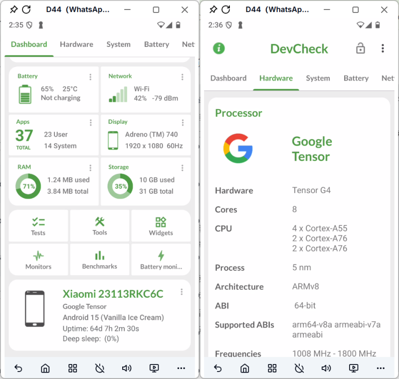

# 📱为什么做 TikTok 不能用模拟器？Android 设备环境检测原理解析
深入解析海外 App 的设备环境检测机制，理解为什么 Android 模拟器越来越容易被识别，以及真实移动设备环境的重要性。

## 概要

Android 模拟器为什么越来越容易被 TikTok、Instagram、WhatsApp 等海外 App 识别？很多人认为问题来自代理 IP 或设备型号，但真正影响账号稳定性的，是整个 Android 设备环境（Device Environment）。

## 一、设备环境检测：海外 App 为什么越来越关注设备？

对于长期运营 TikTok、Instagram、WhatsApp、Telegram 等海外 App 的用户来说，应该都会发现一个明显的变化：

过去，只要配置好代理 IP，并修改设备型号，Android 模拟器通常就能够满足账号运行需求。

而现在，同样的操作方式，却更容易触发：

- 登录验证
- 设备验证
- 风险提醒
- 功能限制
- 账号异常

很多人第一时间会认为：

- IP 不稳定；
- 代理质量差；
- 网络环境存在问题。

这些因素确实会影响账号状态，但已经不是平台判断设备可信度的唯一依据。

随着代理网络越来越成熟，IP 地址可以快速切换，甚至多个用户可能共用同一个出口 IP ，因此，仅依赖 IP 已经越来越难判断设备是否真实。

越来越多海外 App 开始将**设备环境（Device Environment）**纳入风控体系。相比之下，一台 Android 设备的 CPU、Build、GPU、传感器等底层信息更加稳定，也更难伪造。

例如：

- CPU 架构
- Build 信息
- GPU 信息
- 传感器状态
- Android 系统版本
- 屏幕参数
- 时区与语言
- 网络环境

平台真正关注的并不是某一个参数是否正确，而是这些参数之间是否能够组成一套**真实、合理且一致**的移动设备环境，也就是

> **当前运行环境是否符合一台真实 Android 手机的特征。**

## 二、Device Profile：真实移动设备由哪些参数组成？

很多人认为，海外 App 只能获取设备型号、IMEI 或 Android 版本等少量信息。

实际上，Android 系统向应用提供了大量系统接口。在拥有对应权限的情况下，App 可以获取设备运行环境中的多项硬件和系统信息，下面几个参数，也是目前海外 App 最常用的设备检测维度。

### ① CPU：判断设备是否运行在真实移动端

CPU 是 Android 设备最底层的硬件信息之一，也是最难伪造的参数。

绝大多数 Android 手机都采用 **ARM 架构**，例如高通骁龙（Qualcomm Snapdragon）、联发科天玑（MediaTek Dimensity）、麒麟（Kirin）等移动处理器，对应的 CPU ABI 通常为：

- arm64-v8a
- armeabi-v7a

而大多数 Android 模拟器，本质上运行在 PC 环境，因此通常采用 **x86 / x86_64** 架构。

| 对比项 | 真实 Android 手机 | Android 模拟器 |
|--------|------------------|----------------|
| CPU 架构 | ARM | x86 |
| 常见 ABI | arm64-v8a、armeabi-v7a | x86、x86_64 |
| 运行环境 | 移动端硬件 | PC 环境 |

因此，当 App 读取 CPU ABI 时，就能够初步判断当前设备更接近真实手机还是模拟环境。

例如，一台设备即使将 IMEI、设备型号修改为 Google Pixel 3，只要 CPU ABI 返回 **x86**，平台依然能够判断当前运行环境来自模拟器，而不是真实 Android 手机。

### ② Build：设备身份信息（Device Identity）

很多人认为，只要修改设备型号（Model），平台就会认为这是一台新的手机。实际上，**Model 只是 Build 信息中的一个字段。**

对于 Android 系统来说，Build 更像是一台设备的"身份证"，包含品牌、型号、制造商、系统版本以及官方系统指纹等多项信息。

| 参数 | 说明 |
|------|------|
| Brand | 设备品牌（Samsung、Google 等） |
| Manufacturer | 设备制造商 |
| Model | 设备型号 |
| Device | 设备代号（Codename） |
| Product | 产品名称 |
| Hardware | 底层硬件平台 |
| Board | 主板信息 |
| Build Fingerprint | 官方系统指纹 |
| Android Version | Android 系统版本 |
| Security Patch | 安全补丁版本 |

真正的 Android 手机，这些信息能够相互对应。

例如：

- Brand：Google
- Model：Pixel 9
- Build Fingerprint：Google 官方 Fingerprint
- Hardware：对应 Pixel 系列硬件平台

如果只是修改了 Model，而其他 Build 信息仍然保留 Emulator、generic 等默认值，那么对于平台来说，这依然是一台异常设备。

平台真正检查的，并不是某一个字段，而是**整个 Build 信息是否保持一致。**

### ③ Sensor：判断设备是否具备真实移动设备特征

相比 CPU 和 Build，传感器（Sensor）更能反映一台设备是否真正运行在移动终端。

真实 Android 手机通常都会集成多个硬件传感器，例如：

- Gyroscope（陀螺仪）
- Accelerometer（加速度计）
- Magnetometer（磁力计）
- Light Sensor（光线传感器）
- Proximity Sensor（接近传感器）

这些传感器会持续产生实时数据。

例如，当用户拿起手机时，加速度计会记录设备姿态的变化；即使手机静止放置，传感器也会因为电子元件本身的物理特性产生轻微波动，而不会始终保持固定数值。

当 App 检测到设备缺少必要的传感器，或者多个传感器的数据长期保持固定时，就可以快速判断当前运行环境更接近模拟器，而不是真实移动设备。

### ④ GPU：验证整套硬件信息是否一致

很多人认为 GPU 只影响游戏性能。但对于海外 App 来说，GPU 同样属于 Device Profile 的重要组成部分。

平台通常能够读取：

- GPU Model
- GPU Vendor
- OpenGL Renderer
- OpenGL ES Version
- Vulkan Support

这些信息会与 CPU、Build、设备型号共同参与设备一致性校验。

例如，一台设备如果显示为 **Samsung Galaxy S24**，平台通常还会继续验证：

- CPU 是否符合该机型使用的处理器架构；
- GPU 是否符合该型号手机对应的 GPU；
- OpenGL Renderer 是否符合真实 Android 设备的渲染环境。

如果 GPU 返回的是 PC 图形驱动、Mesa OpenGL、SwiftShader 等与设备型号明显不匹配的信息，就可能被识别为异常设备环境。

因此，GPU 检测的目的并不是验证图形性能，而是确认**整套硬件信息是否能够相互对应。**

### Device Profile 并不是单个参数，而是一整套设备环境

除了 CPU、Build、Sensor、GPU 之外，海外 App 还可能读取：

- Android ID
- IMEI
- Screen（分辨率、DPI）
- Timezone（时区）
- Language（语言）
- Bluetooth
- Battery
- Network（SIM、运营商、网络类型等）

这也是为什么很多用户即使修改了 IMEI、设备型号等单一参数，依然会遇到登录验证、设备验证甚至账号风险提示。

## 四、如何验证自己的设备环境？

了解设备检测原理之后，一个更实际的问题是：**如何判断当前设备环境是否正常？**

其实并不需要专业的开发工具，一些常见的 Android 设备信息查看应用，就可以快速查看设备运行环境。

例如：

- DevCheck
- Device Info HW
- CPU-Z
- AIDA64

无论你使用Android设备来运营账号，还是做应用测试，建议重点检查以下几个维度。

### ① CPU

查看 CPU ABI 是否为：

- arm64-v8a
- armeabi-v7a

如果返回：

- x86
- x86_64

则说明当前运行环境更可能来自 Android 模拟器。

### ② Build

检查以下信息是否能够相互对应：

- Brand
- Manufacturer
- Model
- Build Fingerprint

很多模拟器方案只修改了 Model，而 Build Fingerprint、Hardware 等字段仍然保留 Emulator、generic 等默认信息，通过这些字段即可快速判断设备身份是否完整。

### ③ Sensor

查看设备传感器是否能够正常读取数据：

- Accelerometer
- Gyroscope
- Magnetometer

如果设备缺少必要传感器，或者多个传感器数据长期保持固定值，则说明当前环境更接近模拟运行环境。

### ④ GPU

查看 GPU 信息是否与当前设备型号保持一致：

- GPU Vendor
- GPU Model
- OpenGL Renderer

例如，一台设备显示为 Samsung Galaxy S24，但 GPU 返回 PC 图形驱动或 Mesa OpenGL，则说明设备环境存在明显异常。

## 五、DuoPlus云手机：更适合作为海外账号的长期运行环境

对于需要长期运营海外账号的团队来说，仅仅拥有一台真实手机已经很难满足日常运营需求。

例如：

- 管理多个 TikTok、Instagram、Telegram 等账号；
- 配置不同国家和地区的网络环境；
- 长期保持账号在线；
- 批量执行发布、互动等日常操作。

实体手机虽然能够提供真实的移动设备环境，但随着账号数量增加，设备采购、网络配置以及日常维护成本也会快速上升。因此，越来越多团队开始采用 **Cloud Phone（云手机）** 作为长期运行环境。

与传统 Android 模拟器不同，云手机的核心价值并不是"在云端运行 Android"，而是提供更加完整、更接近真实移动设备的运行环境。

以 **DuoPlus云手机** 为例，每台云手机都拥有独立的 Android 系统环境，可以为不同账号提供相互隔离的设备环境。

同时，设备参数会结合配置的网络环境进行一致性优化，使 CPU、Build、GPU、语言、时区等核心参数保持合理匹配，形成更加完整的 **Device Profile（设备画像）**。

除了设备环境之外，云手机还能够进一步解决规模化运营中的设备管理问题，例如：

- 批量管理多个 Android 设备
- 独立配置不同地区网络环境
- 按市场/项目隔离不同账号
- 配合 RPA、AI自动化工具完成重复操作

## ⚙实操建议

如果你有 Android 模拟器和一台真实 Android 手机，可以同时安装 DevCheck。

重点对比以下几个参数：

- CPU ABI
- Build Fingerprint
- GPU Renderer
- Sensor
- Hardware

通过对比两种运行环境，可以更直观地理解 Device Profile 是如何组成的。
