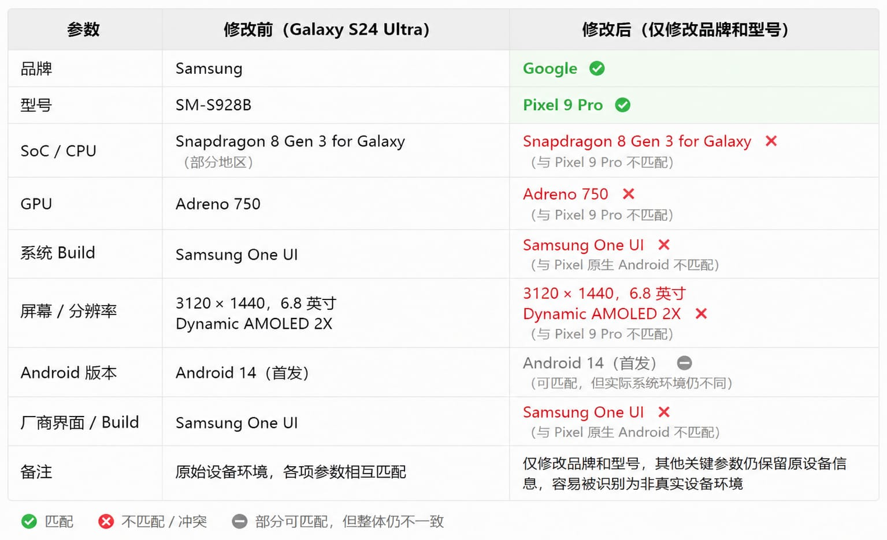
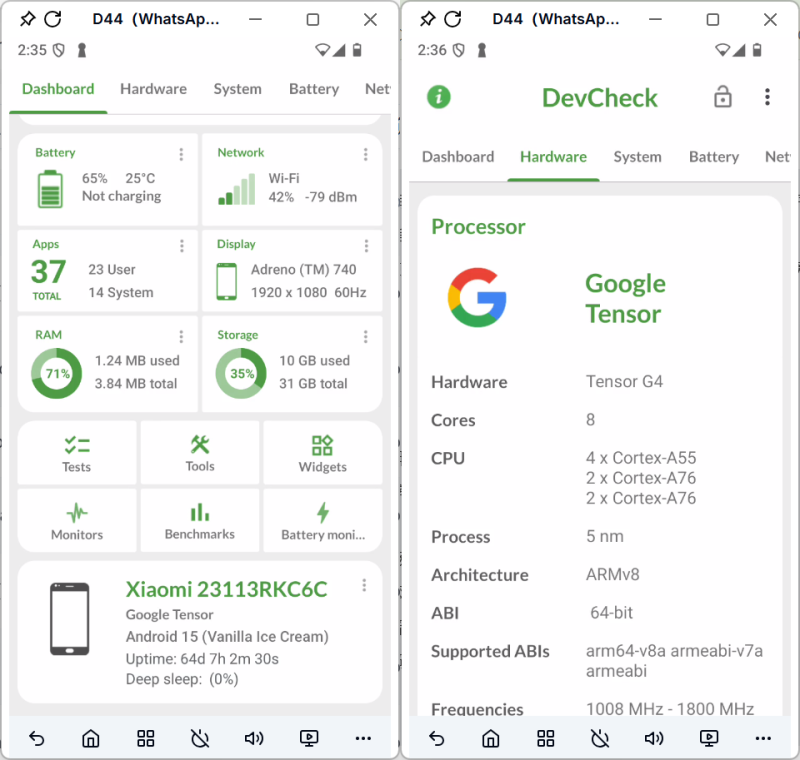

# 📱Android 改机详解：为什么修改设备参数 ≠ 创建新的 Android 环境

很多人在做 Android 多账号管理、App 测试或设备环境隔离时，都会接触到"Android 改机"（Android Device Spoofing）。

网上的大多数教程都会告诉你：

- 修改 IMEI
- 修改 Android ID
- Root
- 刷机
- 恢复出厂设置

似乎只要把这些参数改掉，应用就会认为这是一台全新的设备。

但实际使用过程中，不少人会发现：

- 修改了 IMEI，App 依然能够识别设备；
- Root 后反而触发了更多安全检测；
- 恢复出厂设置后，部分应用仍然要求重新验证；
- 修改了设备型号，多个账号依然存在环境关联。

问题并不是参数改得不够，而是**设备参数（Device Parameters）与 Android 设备环境（Android Environment）本身就是两个不同的概念**。

## 🔍 什么是 Android 改机（Android Device Spoofing）？

Android 改机（Android Device Spoofing）是指通过修改设备标识、系统属性或 Android 配置，让应用识别到不同的设备信息。

很多人认为改机就是修改 IMEI 或 Android ID，但实际上，它通常包含多种不同的操作，不同操作影响的范围也完全不同。

| 操作 | 会改变什么 | 不会改变什么 |
|------|-----------|-------------|
| 刷机（Flash ROM） | Android 系统镜像、系统版本 | 硬件身份、应用数据 |
| Root | 系统权限、底层访问能力 | 完整的设备指纹 |
| 修改设备标识 | IMEI、Android ID、Serial Number、MAC 地址等 | 系统状态、应用数据、硬件安全信息 |
| 恢复出厂设置 | 用户数据、应用、缓存 | 硬件身份、服务端记录、设备环境 |

常见的改机方式包括：

- 📱 刷写官方 ROM 或第三方 ROM
- 🔓 获取 Root 权限
- 🆔 修改 IMEI、Android ID、Serial Number 等设备标识
- 🧹 清除应用数据或恢复出厂设置
- 🌍 修改语言、地区、GPS、时区等配置

> [!IMPORTANT]
> 修改几个设备参数，并不等于创建了一台新的 Android 设备。
>
> **设备参数（Device Parameters）只是 Android 设备环境（Android Environment）的一部分。**

## ⚙️ 为什么 Android 改机以前能够生效？

几年前，Android 改机确实能够帮助部分应用识别为"新设备"。

原因很简单：**早期应用识别设备时，依赖的信息远比现在少。**

当时很多 Android 应用主要读取：

- IMEI
- Android ID
- Device Serial Number
- Wi-Fi
- MAC 地址
- 已安装应用
- 基础网络信息

如果应用主要依赖其中一两个字段，那么修改这些参数后，应用看到的设备就已经发生了变化。

与此同时，当时 Android 系统对于设备标识的访问限制还没有现在严格，Google Play Integrity、硬件级校验等机制也尚未普及。

因此：

- 修改几个关键参数
- 清除应用数据

很多情况下就足以让应用认为：

> "这是一台新的设备。"

## 🛡️ 为什么 Android 改机越来越难？

如今，大多数 Android 应用已经不会只依赖 IMEI 或 Android ID 判断设备。

越来越多的应用开始综合判断**整个 Android 运行环境（Android Environment）**，包括：

- 硬件信息
- 系统状态
- 应用数据
- 网络环境
- 设备完整性（Device Integrity）

近年来，Android 安全机制发生了几项重要变化。

### Google Play Integrity API

越来越多应用开始接入 Google Play Integrity API。

相比过去只读取设备参数，它还会验证：

- Boot Integrity
- Device Integrity
- System Integrity
- Android 运行环境是否可信

### Hardware-backed Attestation

越来越多 Android 设备开始支持 Hardware-backed Attestation（硬件级认证）。

设备完整性信息由安全硬件提供，而不是普通软件，因此也更难伪造。

### Device Fingerprint

现代应用已经不再依赖某一个参数。

它们可能会综合分析：

- Device Model
- Build 信息
- CPU / GPU 信息
- Root 状态
- App 安装记录
- 网络环境
- 地区配置
- 长期行为数据

相比以前：

> "IMEI 有没有变？"

现在更像是在判断：

> **"这一整套 Android 设备环境是否保持一致？"**

---

## ⚠️ 设备参数 ≠ Android 设备环境

这是很多人最容易混淆的一点。

例如：

你把一台 **Samsung Galaxy S24 Ultra** 修改成 **Google Pixel 9 Pro**。

此时：

- Brand ✅
- Model ✅
- Android ID ✅
- IMEI ✅

这些参数看起来都已经修改完成。但设备内部仍然保留着大量没有同步变化的信息，简单理解为：

修改设备参数相对容易，真正困难的是：

**如何长期保持整个 Android 设备环境的一致性。**

这也是为什么：

很多人在反复改机之后，设备参数虽然已经修改完成，但系统状态、应用数据和设备环境之间却越来越不一致。

## 🚀 一种更直接、更有效的思路

与其不断修改同一台设备，不如从一开始就为每个账号创建独立的 Android 环境。

云手机就是这种思路的一种实现方式。

每台云手机都拥有独立的：

- Android 操作系统
- 设备参数
- 应用数据
- 网络环境
- 地区配置

由于每个环境天然隔离，因此无需反复修改 IMEI、Android ID 等参数，也不需要不断重置同一台设备。

这种方式更适合：

- 📱 多账号管理
- 🧪 App 测试
- 🌍 多地区环境验证
- 🤖 自动化运营

## ✅ 总结

Android 改机并没有失去价值。在设备测试、ROM 开发、系统调试等场景下，它依然是一种常见的方法。

但对于现代 Android 应用而言，真正决定设备身份的，已经不只是几个设备参数，而是整个 Android 运行环境的一致性，包括：

- 系统状态
- 应用数据
- 网络配置
- Device Fingerprint
- Device Integrity

对于需要长期管理多个 Android 环境的团队来说，真正需要解决的问题已经从：

> **"如何修改设备参数？"**

逐渐变成了：

> **"如何持续维护稳定、独立且一致的 Android 设备环境？"**
